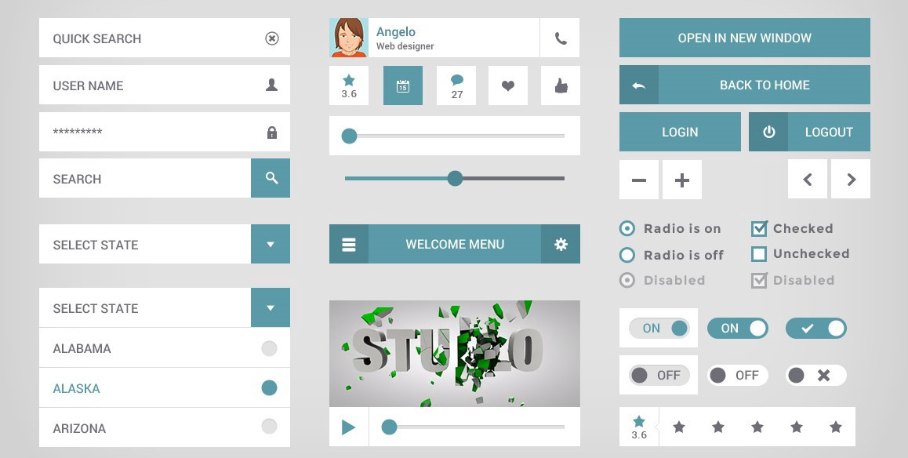

*Using UI Frameworks: Easier or harder to code?*

 UI Frameworks allow the programmer to have structure and somewhere to start from. Although they are not always simple, it takes a lot of work off of our shoulders. With frameworks, it allows for stylized and structured looking web pages. It also gives the programmer a lot of components to choose from to add to their web page. Web pages look cleaner and professional when using UI Frameworks. Having and using frameworks in your code goes back to the reason why coding standards exist. It allows for more uniform code so that it is more efficient and readable to other programmers.

 There are many reasons why UI frameworks are beneficial for software engineers. First of all, it gives engineers a set of defined components that can be reused throughout their code to improve efficiency. Having the same structure for making paragraphs, making columns, or adding images to your web page saves a lot of time. It also is more user-friendly because the components are simple and easy to use. Using frameworks also allows the code to be more organized. Although it is quite frustrating to figure out how to make your navbar icons align to the right or how to space them out correctly, the outcome is worth it.

    

        

        
        

    

    

        

        
        

    

    

 When I was attempting to recreate the University of Hawaii at Manoa's web page for an assignment, I was stuck formatting the navbar for 30 minutes. I could not figure out how to properly add padding to both sides of my navbar. But all I had to do to remedy this situation was to go to the Bootstrap 5 website and they have all formatting tips for many different situations. I actually had fun trying to figure out how to replicate UHM's website. I spent over 3 hours trying to replicate its home page. Honestly, it would have taken longer if I did not use Bootstrap 5 or any UI frameworks. I also enjoyed the fact that Bootstrap 5 has icons that you can choose from to add to your navbar or other components of your web page.

 Overall, I enjoyed my experience with UI frameworks. It makes web pages look cleaner and professional. It also is more efficient and follows coding standards.

