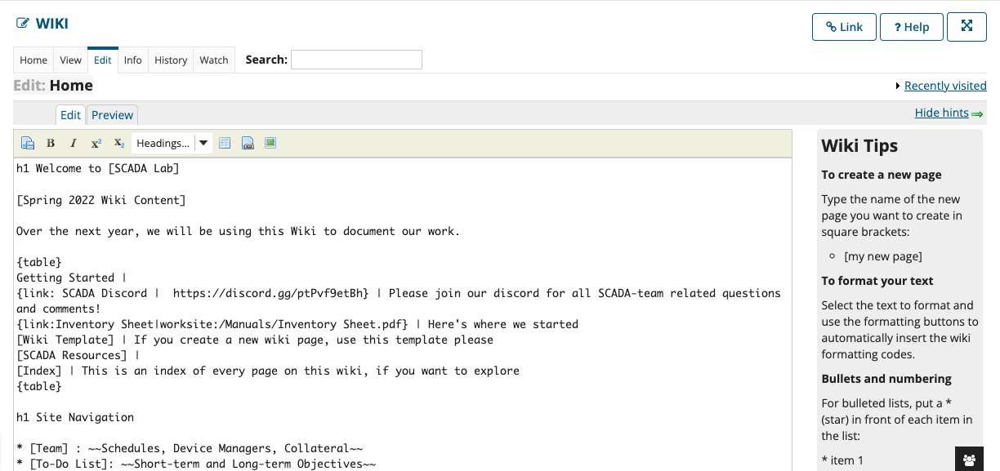
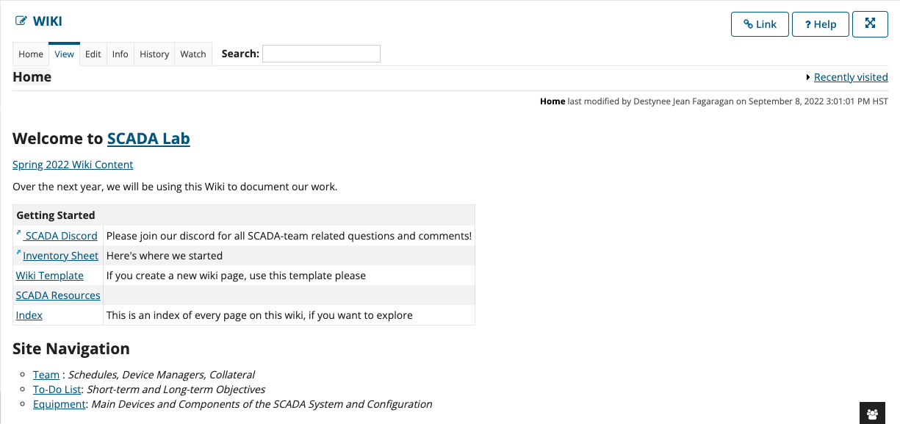
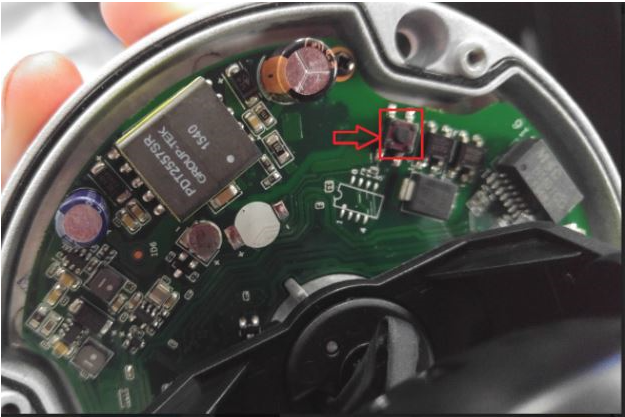

## SCADA Lab

Personally, this started as a 396 capstone class that I need to take because it was required for graduation. As we went through the semester, we were able to stand up a small SCADA system. Our ideal goal is to get the system to be remote and wireless. We were given jobs in the beginning of the semester and were responsible for a part of the system. We were given a piece of equipment and were asked to familiarize ourselves with it and make them work together. Our next steps were to analyze and identify critical cyber terrain and deploy sensors on the remote network to flow data to a signature-based Intrusion Detection System.

## My Work

I was assigned with the Webmaster position and configuring our security camera. The whole project is documented through our Wiki site on Laulima. The webmaster is in charge of making sure the Wiki is efficient and is formatted in a way that is easy to access. The Wiki site uses a similiar coding style to HTML CSS where there is a certain way to create a table, make font bold, etc. Overall, the Wiki is the heart of our SCADA system because this capstone project is carried from semester to the next. When a new semester starts, the next group of students will have to pull relevant information from the Wiki to continue to improve the SCADA system. I also was in charge of the security camera for the system. I was given an old AMCREST Security Camera and I had to read the manual and figure out how it works and how to incorporate it in our system. We were going to use the security camera to monitor the remote part of the system. 

## Experience
I am currently in my second semester of the SCADA capstone project to fulfill my 496 requirement. I learned a lot from my first semester with Professor Nelson and working on the SCADA system. He treated the class and project like it was an actual job. We started off the semester with job applications and interview questions. This helped with assigning each student to each equipment piece and role. It forced us to learn responsibility and teamwork skills. We had to take ownership of our equipment and roles.
