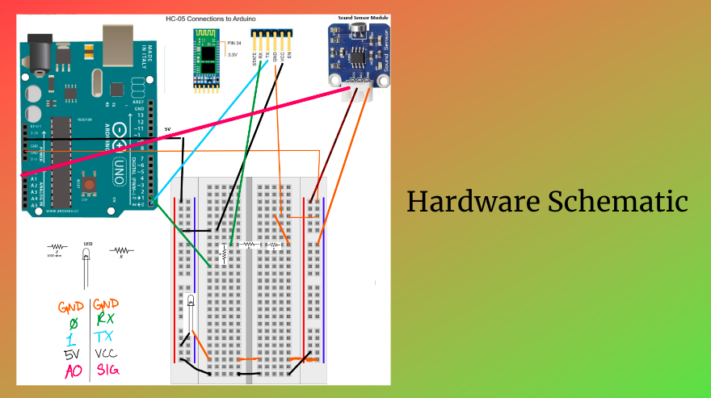

Hush is an android application that received sound input through a microcontroller sound sensor and outputting a color screen that indicated sound level. This application was made for teachers, caretakers, and parents to allow them to monitor volume of young children in a controlled setting. The simple design allows students to see and understand what noise level they are at.

An arduino microcontroller, sound sensor, and device were all implemented in this project. Bluetooth connection allowed the sound sensor to send data through our android application where we programmed a certain color to a range of numbers to indicate high and low levels.

The images below are the android application that my partner and I developed and designed, as well as the hardware schematic that contained the Arduino microcontroller and sound sensor.

