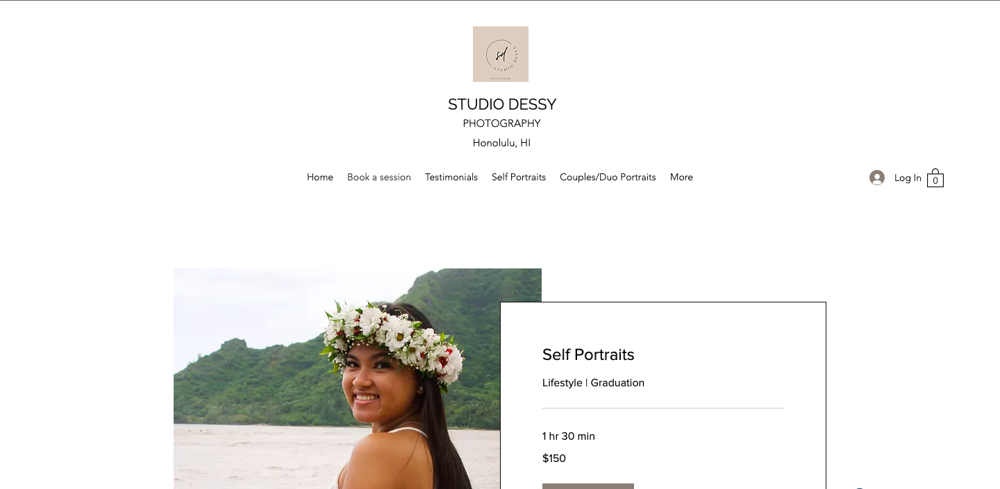
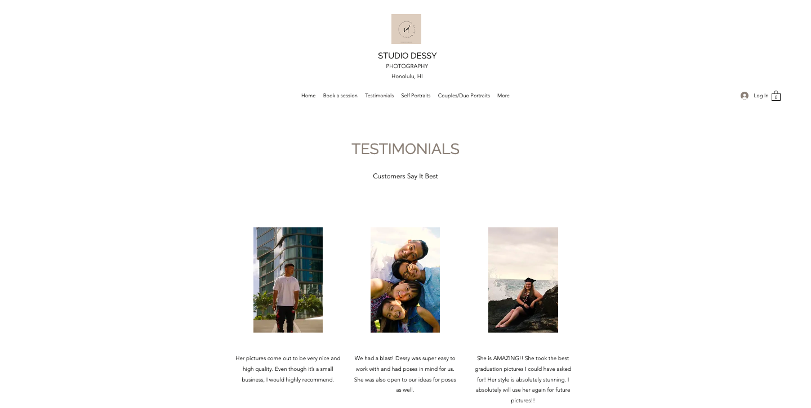

For a while, I was just advertising my photography services through social media and word of mouth. I decided to design my own website with my own domain. I built my website through Wix's Artificial Design Intelligence. There were multiple aspects I needed to run this website successfully to where it was efficient for my business. I wanted to take bookings through this website so this means that I needed a eCommerce system and a booking client. But before I could do that, I built the structure of my website by starting with the theme and format. On my homepage, I made sure to put examples of my work up-front and center so that it grabs the customers' attention and gives a good impression. Then below that, I added quick links to the photography packages I offer so that it is what they see right after seeing samples of my work. 

Then I created the different pages that are essential for my site. I added pages such as, "Book a session", "Testimonials", and galleries for each specific category. I wanted to design this website so that it was easy to navigate. My goal was to create an easy booking experience for my clients and display my work as well. There is also a chat widget where clients can message me and I can live-reply while they are still browsing through my site. If you would like to visit and browse through my website yourself please see the link below.

[Visit Studio Dessy: Click here!](www.studiodessy.com)

